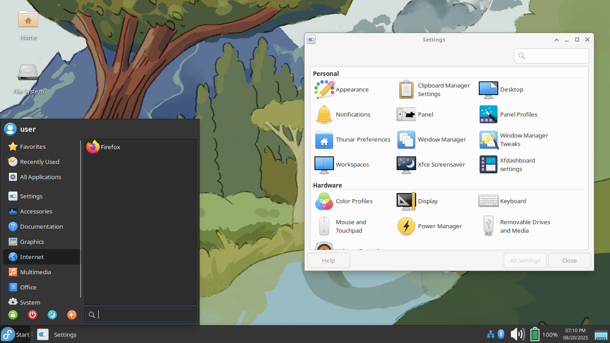

# How-To:

1. Install a Fedora Atomic os. Preferably the [sway](https://fedoraproject.org/atomic-desktops/sway/download/) one, since it's small and lets you create a user during setup.

```
sudo ostree admin pin 0
```

2. Rebase to the image and reboot

```
sudo rpm-ostree rebase ostree-unverified-registry:ghcr.io/adamthiede/bluefin:latest
sudo reboot
```

3. Rebase to the image again, after it's trusted.

```
sudo rpm-ostree rebase ostree-image-signed:docker://ghcr.io/adamthiede/bluefin:latest
sudo reboot
```

For Brave or Chrome instead of Firefox, use `:brave` or `:chrome` instead of `:latest` in the commands above.

# What is this?

This is an opinionated, customized, Fedora Atomic XFCE. It is inspired by [nixbook](https://github.com/mkellyxp/nixbook). It's intended for low-spec machines like old chromebooks or celeron/pentium laptops.

Main changes:

- rpmfusion repos and drivers for Intel GPUs
- keyd, for potential chromebook key remaps (see [here](https://github.com/WeirdTreeThing/cros-keyboard-map))
- some unnecessary programs and packages removed
- libreoffice writer/calc/impress (word/powerpoint/excel)
- redshift for screen temperature adjustment
- pre-configured theme and desktop layout
- elementary xfce icons
- automatic ostree updates
- flathub remote added - flatpaks take up a lot of space, but it's a useful way to have applications if you have the storage.

# What does it look like?



It's just [Fedora Xfce](https://fedoraproject.org/spins/xfce).
